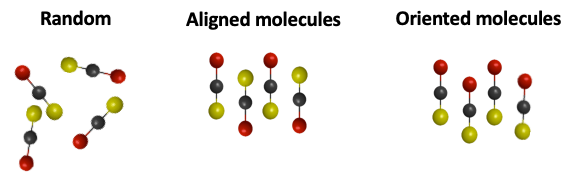

# About This Repository
Paper: *"[Field-free molecular orientation of nonadiabatically aligned OCS](https://www.sciencedirect.com/science/article/abs/pii/S0009261418300095)"*

This repository contains a simulator for studying **quantum rotational dynamics of linear asymmetric molecules** induced by intense femtosecond (fs) laser pulses. An old version of this simulator was used to find optimal conditions of laser parameters to control molecular orientation (i.e., the head-to-tail order of linear asymmetric molecules) and make a comparison between simulated and experimental results in [[1](https://www.sciencedirect.com/science/article/abs/pii/S0009261418300095)].

# What Does This Simulator Do?
## General Explanation
Theoretical details are explained in [[1](https://www.sciencedirect.com/science/article/abs/pii/S0009261418300095)]. With this simulator, quantum rotational dynamics of linear asymmetric molecules induced by a combination of a near-infrared (800 nm) intense fs laser pulse and two-color (800 nm + 400 nm) intense fs laser pulses can be investigated by numerically solving time-dependent [Schrödinger equation](https://en.wikipedia.org/wiki/Schrödinger_equation). Using simulated results, molecular orientation (i.e., head-to-tail order) and molecular alignment (i.e., molecular axis aligned along a specific line without considering the head-to-tail order) can be quantitatively evaluated.   
  
Simulation results are saved in text files for further detailed study. As an example, alignment parameter (= expectation value of cos2θ) and orientation parameter (= expectation value of cosθ) are visualized below with some visual explanations.  
   
It should be noted that symmetric linear molecules and other types of molecules with different symmetries cannot be handled with this simulator.
## Output files
- `cos.txt`: Time in picosecond and expectation value of cosθ in the first and second columns, respectively.
- `cos2.txt`: Time in picosecond and expectation value of cos2θ in the first and second columns, respectively.
- `intpop.txt`: Initial rotational-state distribution determined by temperature. Rotational quantum number and population in the first and second columns, respectively. 
- `finpop.txt`: Final rotational-state distribution after interacting with lasers. Rotational quantum number and population in the first and second columns, respectively.
- `output.txt`: Simulation information including simulation quality, parameters, simple statistics, and computation time. 

# How to Use?
1. Specify simulation parameters in `params.h` and save it.
2. Run `main.cpp`. To do so, use the command `bash run.sh` in Terminal.

# Validity of Results
Validity of results can be checked by monitoring following values:
- Norm of coefficinets of wavefunctions (expected to be close to 1)
- Imaginary part of the expectation values of cosine and cosine squared. (expected to be 0)   

Extremely large deviations mean that some parameter settings are inappropriate. For example, the time step in the process of numerically solving differential equations might be too large.
# References
[[1](https://www.sciencedirect.com/science/article/abs/pii/S0009261418300095)] K. Sonoda, A. Iwasaki, K. Yamanouchi, and H. Hasegawa, Field-free molecular orientation of nonadiabatically aligned OCS, Chem. Phys. Lett., 693, 114-120, 2018
